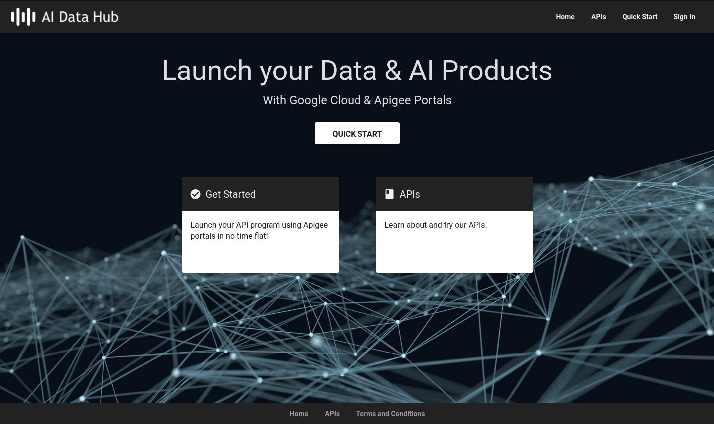
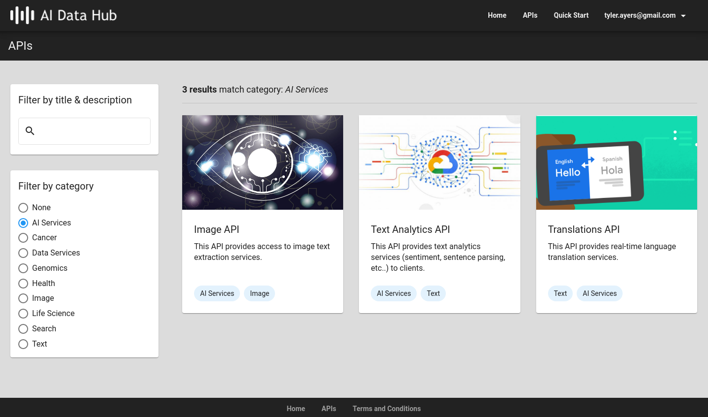

# apigee-x-ai-marketplace
This is an example project to create a small AI service marketplace using
[Google Cloud Apigee](https://cloud.google.com/apigee) and several [GCP AI services](https://cloud.google.com/products/ai).




This project will deploy example API proxies to Google Cloud Translate, Text
Analytics and Vision services, which we can test publishing and managing
subscriptions to in a sample portal (as pictured above).

## Steps to deploy

1. Download the [v1 release](https://github.com/tyayers/apigee-x-ai-marketplace/releases/tag/v1) of the AI Services API proxy and import into Apigee by
   going to **Develop > API Proxies > Create New**.  This proxy will provide an API facade to 3 Google AI backend services.
2. Select **Upload proxy bundle** and select the ZIP file downloaded in step 1.
3. Confirm all selections and save the new proxy (do not deploy yet).
4. For the deployment we will need a GCP service account configured with the
   permissions (for example the "Editor" or "AI Platform Developer" roles) to call the Google AI services.  Create or identify a service account and copy the service account email address (this will be used for the apigee deployment in the next step).
5. Now go back to the Apigee console, and deploy the newly created proxy, and add the service account email when deploying.  This account will be used to call the AI backend services.
6. Now test the deployed proxy with a call like this (replace the base URL with your own Apigee environment group base URL):

```bash
curl --location --request POST 'https://api-dev.apigee-x.theapishop.com/ai/translation' \
--header 'Content-Type: application/json' \
--data-raw '{
  "q": "The Great Pyramid of Giza (also known as the Pyramid of Khufu or the Pyramid of Cheops) is the oldest and largest of the three pyramids in the Giza pyramid complex.",
  "source": "en",
  "target": "es",
  "format": "text"
}'
```
7. You should get a 401 response that the call is not authorized.

```bash
{
    "fault": {
        "faultstring": "Failed to resolve API Key variable request.header.x-apikey",
        "detail": {
            "errorcode": "steps.oauth.v2.FailedToResolveAPIKey"
        }
    }
}
```
8. The proxy is enforcing an API key authorization to access the services, so we need to create API products in Apigee and publish the products to the portal for users to access, subscribe to, and get credentials to access.
9. In Apigee, create API Products for the Translation, Image and Text APIs (filtering our proxy on the paths /translation, /image and /text paths).
10. Create a new API portal and publish the products, then register and create credentials and subscribe to the products.
11. Now try a new call with an x-apikey header with your credentials.

```bash
curl --location --request POST 'https://api-dev.apigee-x.theapishop.com/ai/translation' \
--header 'x-apikey: YOUR_API_KEY' \
--header 'Content-Type: application/json' \
--data-raw '{
  "q": "The Great Pyramid of Giza (also known as the Pyramid of Khufu or the Pyramid of Cheops) is the oldest and largest of the three pyramids in the Giza pyramid complex.",
  "source": "en",
  "target": "es",
  "format": "text"
}'
```
12. Now you should get the correct translation as response.
```bash
{
    "data": {
        "translations": [
            {
                "translatedText": "La Gran Pirámide de Giza (también conocida como la Pirámide de Keops o la Pirámide de Keops) es la más antigua y la más grande de las tres pirámides del complejo piramidal de Giza."
            }
        ]
    }
}
```
